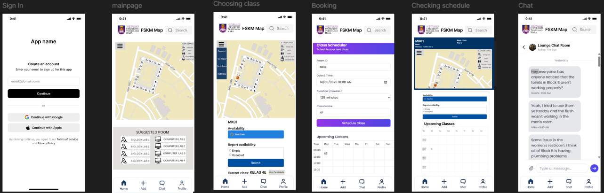
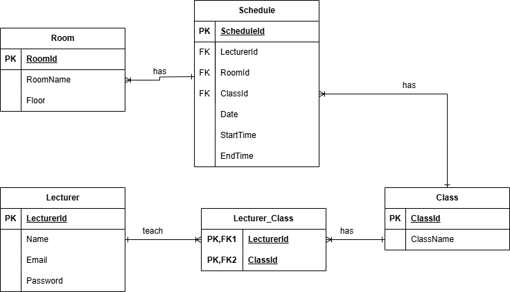
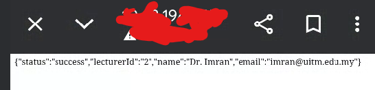

# 📱 UITM Lecturer Schedule App – Development Log

---

## 🖌️ Design and Prototyping (FIGMA)
- ✅ **UI Design** – Visually appealing and user-friendly
- ✅ **UX Design** – Smooth navigation and flow
- 🔄 **Prototype Development** – Currently at **20%**

### 📷 Screenshot: Interface Design

---

## 💻 Development (Kotlin, Android Studio)
- 🔲 **Chosen Language**: Kotlin ✅ (planned)
- 🔲 **App Features**: UI, scheduling, etc.
- 🔲 **API Integration** (Retrofit + PHP, if needed)
- 🔲 **Regular Testing** and Debugging

---

## 🗄️ Database Design (ERD, MySQL, PHP)
- ✅ **ERD Created** – Based on required features
- ✅ **Normalized Tables** – No redundancy
- ✅ **Using MySQL** (via PHP backend)

### 📷 Screenshot: Database Schema

---

## 🔐 User Authentication and Authorization
- 🔲 **Lecturer Login System** (email + password)
- 🔲 **Password Hashing** (SHA-256 or bcrypt)
- 🔲 **Session Management**
- 🔲 **User Roles & Permissions**

---

## 🧠 User Interface and Experience
- 🔲 Prioritize user-friendly layouts (ongoing)
- 🔲 Conduct **usability testing** (peer feedback)
- 🔲 Ensure **accessibility** (text size, contrast, etc.)

---

## 📊 Progress Summary

| Module                         | Status       |
|--------------------------------|--------------|
| UI/UX Design (Figma)           | ✅ 80%        |
| App Feature Implementation     | 🔲 Starting   |
| Database Schema (ERD + SQL)    | ✅ Completed  |
| API + Backend (PHP + MySQL)    | 🔲 Not started|
| Authentication/Login System    | 🔲 Not started|
| Usability & Accessibility Test | 🔲 Not started|

---

## ✍️ Notes
> This is a final-year individual project for UITM, focused on helping new lecturers create and manage their class schedules easily using an Android mobile app.

---

## 🚧 To-Do Next:
- [ ] Build UI in Android Studio from Figma
- [ ] Implement login logic (Retrofit + PHP + MySQL)
- [ ] Store and retrieve schedule data via API

## 🔗 new knowledge
## 🔗 how to add Dependency (to access library)
 
 1)go to any github source to find ur preference 
    
 2)add this to dependency {} in build.gradle.kts(module app)

implementation ("com.davemorrissey.labs:subsampling-scale-image-view:3.10.0")
 
 3) add  mavenCentral() in settings.graddle.kts (add google and JitPack also so u dont need to touch anything in this file ever again when u wanna add another dependency) this is like the "host" or idk
 4) sync now
 
 5) check ur version dependency in libs.versions.toml

 6)useee that in kt(import the dependency and use ur own class from it )

 7) call the class to use it in ur layout xml page

 ## ✍️ for navigation each page
 
 val registerNow = findViewById<TextView>(R.id.registerNow)
registerNow.setOnClickListener {
    val intent = Intent(this, RegisterActivity::class.java)
    startActivity(intent)
}
 ## ✍️  for Draggable icon/blocks for more convenience

 <!-- Replace the map_container FrameLayout with this: -->
  <androidx.constraintlayout.widget.ConstraintLayout
    android:id="@+id/map_container"
    android:layout_width="match_parent"
    android:layout_height="0dp"
    android:background="#F5E6B8"
    app:layout_constraintTop_toBottomOf="@id/header_layout"
    app:layout_constraintBottom_toTopOf="@id/suggested_room_layout"
    app:layout_constraintStart_toStartOf="parent"
    app:layout_constraintEnd_toEndOf="parent">

    <!-- Map Background -->
    <ImageView
        android:id="@+id/iv_map_background"
        android:layout_width="match_parent"
        android:layout_height="match_parent"
        android:src="@drawable/map_background"
        android:scaleType="centerCrop"
        app:layout_constraintTop_toTopOf="parent"
        app:layout_constraintStart_toStartOf="parent" />

    <!-- Now these markers will be draggable in the visual editor -->
    <ImageView
        android:id="@+id/marker_building_1"
        android:layout_width="24dp"
        android:layout_height="24dp"
        android:src="@drawable/ic_building_marker"
        android:clickable="true"
        android:focusable="true"
        android:background="?android:attr/selectableItemBackgroundBorderless"
        android:contentDescription="Building 1"
        app:layout_constraintTop_toTopOf="parent"
        app:layout_constraintStart_toStartOf="parent"
        app:layout_constraintHorizontal_bias="0.2"
        app:layout_constraintVertical_bias="0.3" />

    <ImageView
        android:id="@+id/marker_building_2"
        android:layout_width="24dp"
        android:layout_height="24dp"
        android:src="@drawable/ic_building_marker"
        android:clickable="true"
        android:focusable="true"
        android:background="?android:attr/selectableItemBackgroundBorderless"
        android:contentDescription="Building 2"
        app:layout_constraintTop_toTopOf="parent"
        app:layout_constraintStart_toStartOf="parent"
        app:layout_constraintHorizontal_bias="0.4"
        app:layout_constraintVertical_bias="0.35" />

    <ImageView
        android:id="@+id/marker_building_3"
        android:layout_width="24dp"
        android:layout_height="24dp"
        android:src="@drawable/ic_building_marker"
        android:clickable="true"
        android:focusable="true"
        android:background="?android:attr/selectableItemBackgroundBorderless"
        android:contentDescription="Building 3"
        app:layout_constraintTop_toTopOf="parent"
        app:layout_constraintStart_toStartOf="parent"
        app:layout_constraintHorizontal_bias="0.3"
        app:layout_constraintVertical_bias="0.4" />

    <ImageView
        android:id="@+id/marker_building_4"
        android:layout_width="24dp"
        android:layout_height="24dp"
        android:src="@drawable/ic_building_marker"
        android:clickable="true"
        android:focusable="true"
        android:background="?android:attr/selectableItemBackgroundBorderless"
        android:contentDescription="Building 4"
        app:layout_constraintTop_toTopOf="parent"
        app:layout_constraintStart_toStartOf="parent"
        app:layout_constraintHorizontal_bias="0.6"
        app:layout_constraintVertical_bias="0.45" />

    <!-- Zoom Controls -->
    <LinearLayout
        android:id="@+id/zoom_controls"
        android:layout_width="wrap_content"
        android:layout_height="wrap_content"
        android:orientation="vertical"
        app:layout_constraintEnd_toEndOf="parent"
        app:layout_constraintTop_toTopOf="parent"
        app:layout_constraintBottom_toBottomOf="parent"
        android:layout_marginEnd="16dp">

        <ImageView
            android:id="@+id/btn_zoom_in"
            android:layout_width="40dp"
            android:layout_height="40dp"
            android:src="@drawable/ic_zoom_in"
            android:background="@drawable/bg_zoom_button"
            android:clickable="true"
            android:focusable="true"
            android:contentDescription="Zoom In"
            android:layout_marginBottom="8dp" />

        <ImageView
            android:id="@+id/btn_zoom_out"
            android:layout_width="40dp"
            android:layout_height="40dp"
            android:src="@drawable/ic_zoom_out"
            android:background="@drawable/bg_zoom_button"
            android:clickable="true"
            android:focusable="true"
            android:contentDescription="Zoom Out" />

    </LinearLayout>

</androidx.constraintlayout.widget.ConstraintLayout>

# BASIC STRUCTURE KOTLIN ANDROID STUDIO

---

## 📁 res/layout (XML Files)
- Stores all the **UI layouts** of the app (buttons, text, views).
- Each screen uses its own `.xml` file.
- Example: `activity_main.xml`, `login_screen.xml`

## 🖼 res/drawable (Images & Assets)
- Contains **custom pictures** like logos, icons, backgrounds.
- These are used inside XML files via `@drawable/filename`.

## ⚙️ Kotlin Files (`.kt`)
- Used for writing **functional code** (button clicks, API calls, navigation).
- Example: `MainActivity.kt`, `LoginActivity.kt`

## 📄 AndroidManifest.xml
- This file **registers activities**, sets permissions (e.g. `INTERNET`), and defines the app's main entry point.
- It connects all parts of the app together.

---

## 🔗 How It All Connects
1. XML layouts define what the user sees.
2. Drawable images are used inside XML files.
3. Kotlin code adds behavior to the layouts.
4. AndroidManifest.xml ties it all together.

---

✅✅✅✅✅✅✅✅✅✅✅✅✅✅✅✅✅✅✅✅✅✅✅✅✅✅✅✅✅✅✅✅✅✅✅✅✅✅✅✅✅✅✅✅✅✅✅✅✅✅✅✅✅✅✅✅✅✅✅